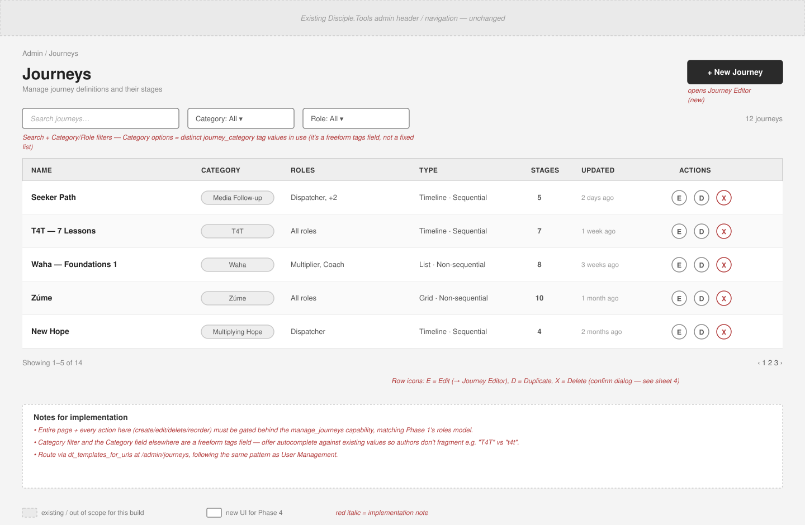
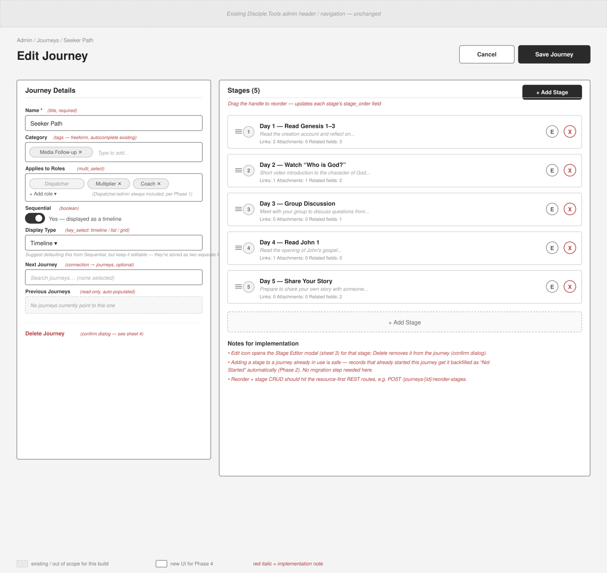
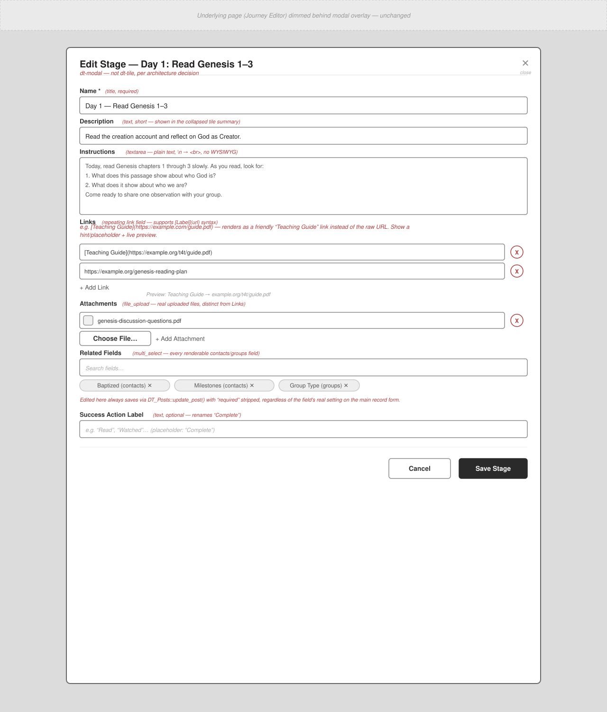
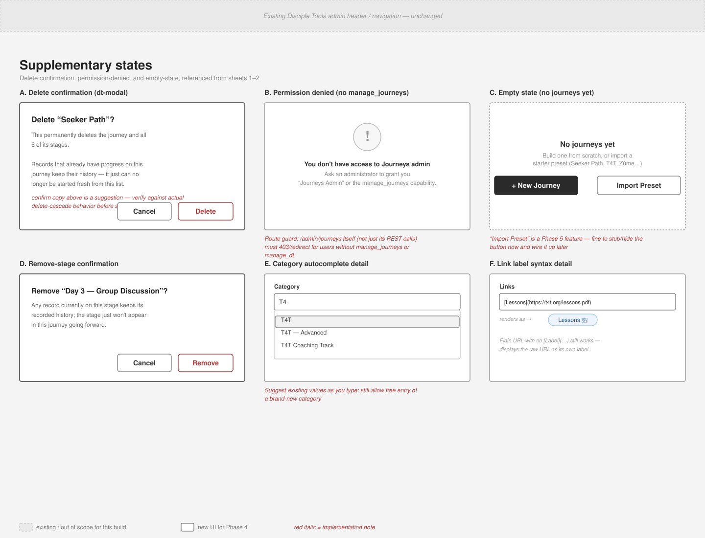

# Journeys Admin UI — Phase 4 mockups

Low-fidelity wireframes for the `/admin/journeys` definition builder: the journeys list, the
journey editor with its stage list, the stage editor modal, and the supporting dialog/empty
states. Every field on the `journeys` and `journey_stages` post types (per
`post-type/journeys-post-type.php` and `post-type/journey-stages-post-type.php`) is represented
somewhere below.

> **Posting this into a GitHub issue?** GitHub issues don't render relative image paths the way
> a repo README does — each `![...]` line below needs an actual hosted URL. Easiest options:
> 1. Open the issue editor and **drag each `.svg` file from this folder** into the body where its
>    placeholder line is — GitHub uploads it and rewrites the link automatically.
> 2. Or, once these SVGs are committed and pushed, swap each relative path for its
>    `raw.githubusercontent.com/<org>/<repo>/<branch>/.specs/mockups/phase4-admin/<file>.svg` URL.

**Legend:** dashed hatch = existing DT shell, out of scope for this build · solid outline = new
UI for Phase 4 · *red italic text inside each mockup* = implementation note, not literal copy.

---

## Sheet 1 / 4 — Journeys list (`/admin/journeys`)

Landing page for the admin. Search + filter by category/role, a table of existing journey
definitions, and the entry point into the editor. Gate the whole route on `manage_journeys` (or
`manage_dt`).



---

## Sheet 2 / 4 — Journey editor

Create/edit a journey: its own fields on the left, its ordered stage list on the right.
Drag-reorder writes `stage_order`; the Edit icon on a stage row opens Sheet 3.



**Journey fields covered:**

| Field | Type |
| --- | --- |
| Name | title, required |
| Category | tags — freeform, autocomplete |
| Applies to Roles | multi_select |
| Sequential | boolean |
| Display Type | key_select: timeline / list / grid |
| Next Journey | connection → journeys, optional |
| Previous Journeys | connection, read-only |
| Stages | ordered connection → journey_stages |

---

## Sheet 3 / 4 — Stage editor (`<dt-modal>`)

Every field on a single stage. Links and Attachments are deliberately separate sections — Links
are external URLs (with optional `[Label](url)` naming), Attachments are real uploaded files.
Related Fields edits here always strip `required`, matching the Phase 3 stage pop-out's rule.



**Stage fields covered:**

| Field | Type |
| --- | --- |
| Name | title, required |
| Description | text, short |
| Instructions | textarea — plain text, `\n` → `<br>` |
| Links | repeating link — `[Label](url)` syntax |
| Attachments | repeating file_upload |
| Related Fields | multi_select of contacts/groups fields |
| Success Action Label | text, optional |
| Stage Order | number — set via drag reorder, not typed |

---

## Sheet 4 / 4 — Supplementary states

Six smaller states referenced from Sheets 1–3: delete/remove confirmations, the
permission-denied screen for users without `manage_journeys`, the empty state, and close-ups on
the category autocomplete and the link-label syntax.



---

Source files (editable SVG, hand-authored — not exported from a design tool):

```
.specs/mockups/phase4-admin/1-journeys-list.svg
.specs/mockups/phase4-admin/2-journey-editor.svg
.specs/mockups/phase4-admin/3-stage-editor-modal.svg
.specs/mockups/phase4-admin/4-supplementary-states.svg
```
